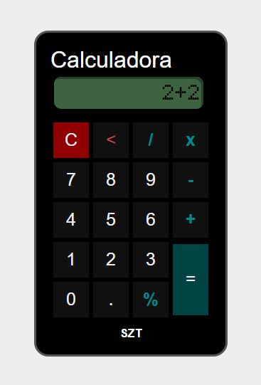

# Calculadora

    
    
    

 

Esta calculadora oferece uma interface amigável e responsiva com funcionalidades básicas de operações matemáticas: adição, subtração, multiplicação e divisão. 

Uma das características visuais deste projeto é a utilização da fonte [LED Calculator](https://www.dafont.com/led-calculator.font) para exibir os números na tela.

 

    

